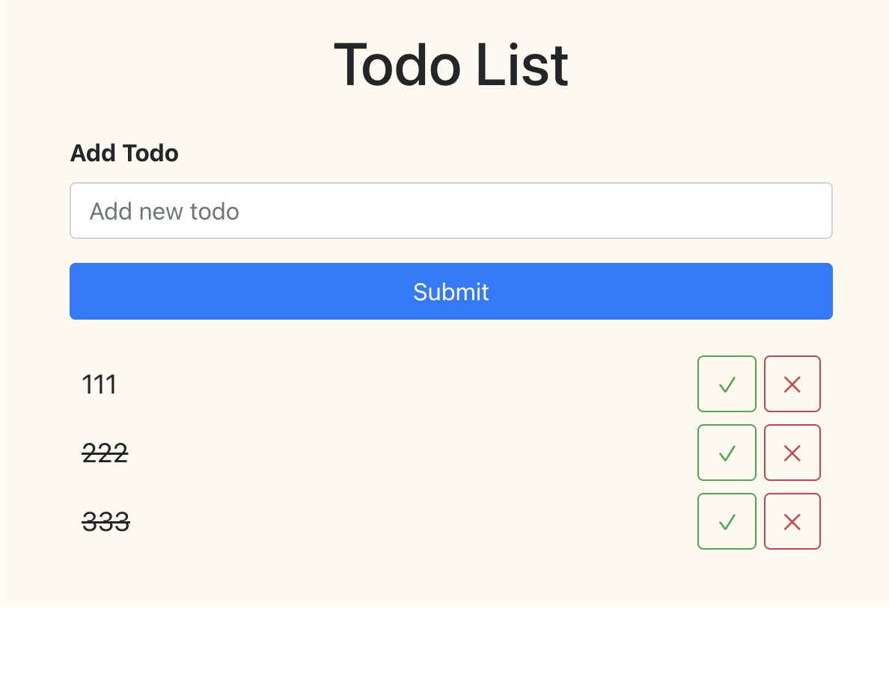
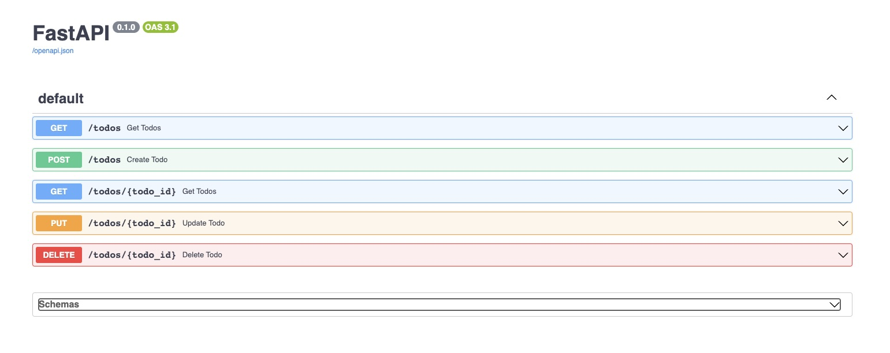

# FastAPI_Todo_React_Sqlite

This project combines FastAPI, React, and SQLite to create a simple Todo application.

## Installation

To get started, you need to have Python and Node.js installed on your machine.

1. Install FastAPI and Uvicorn:
2. Run the FastAPI server: <br />
   uvicorn main:app --reload


3. Create the SQLite database table `todos`:

```sql
CREATE TABLE todos (
id INTEGER NOT NULL PRIMARY KEY,
item VARCHAR,
isDone INTEGER
); 
```

### React Todo App

This project includes a minimalist Todo application built using React. The original source for the React Todo app can be found [here](https://github.com/shubham1710/React-Todo/tree/master). The app has been thoughtfully customized and enhanced to align seamlessly with the objectives of this project.

In addition to the React frontend, I have integrated a robust Python backend powered by FastAPI and SQLite. This backend setup enables comprehensive CRUD (Create, Read, Update, Delete) functionality for managing your todo items. The FastAPI framework also brings the advantage of built-in Swagger documentation, making it easy to explore and test the API endpoints (http://localhost:8000/docs).

Feel free to explore, modify, and utilize this project to streamline your own todo management. If you have any inquiries or suggestions, please don't hesitate to get in touch.

Happy organizing and coding!

### Attribution
### https://github.com/shubham1710/React-Todo/tree/master




